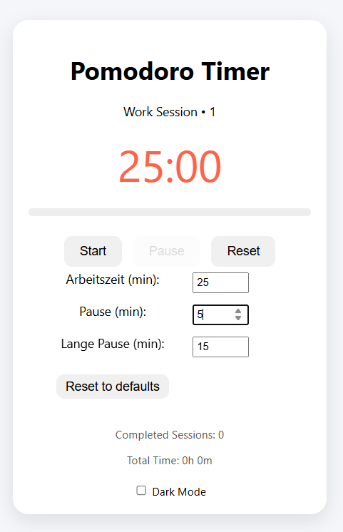

# **📦 pomodoro-timer**

A minimal Pomodoro Timer built with vanilla HTML, CSS, and JavaScript – no frameworks, no dependencies.
The goal wasn’t just to create a working timer, but to make the process of building it transparent and traceable through clean Git commits.

## **🚀 Features**

- Start, pause, and reset for work and break sessions
- Automatic switching between work, short breaks, and long breaks
- User settings and stats are stored locally via localStorage
- Responsive design with an optional dark mode
- Modular JavaScript structure (fully refactored)
- Developed as a public showcase with a well-documented Git history

## **🖼️ Screenshots**

## **🧾 Lizenz**

MIT License

## **👤 Autor**

**Kai ([@chefkoch0312](https://github.com/chefkoch0312))**
[https://kado-ber.de](https://kado-ber.de)

